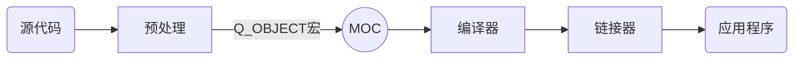

## QObject
### MOC 与 QObject
元对象系统是一个C++扩展，使该语言更适合真正的组件化GUI编程。
QObject类是所有使用元对象系统的类的基类。
- 并不是所有Q开头的类都是Object的派生类，例如QString

在一个类的private部分声明Q_OBJECT宏。
>使用信号与槽机制，只有添加Q_OBJECT宏，moc才能对类里的信号与槽进行预处理

MOC（元对象编译器）为每个QObject的子类提供必要的代码。
>元对象编译器（Meta-Object Compiler，MOC）是一个预处理器，先将Qt的特性程序转换为标准C++程序，在由标准C++编译器进行编译


### QObject
QObject是Qt对象模型的核心。
标准的C++对象模型在某些领域不够灵活。图形用户界面编程是一个**既需要运行效率又需要高度灵活性**的领域。QObject提供了灵活性。
>QObject不支持拷贝！QObject 的拷贝构造函数和赋值运算符是私有的，并且使用了Q_DISABLE_COPY()宏

QObject在对象树中组织自己。
- 当以另一个对象作为父对象创建QObject时，该对象将自动将自身添加到父对象的子对象列表中。
- 父对象删除时，它将自动删除其子对象。可以使用findChild（）或findChildren（）按名称和可选类型查找对象。


## 信号和槽
槽的本质是类的成员函数。参数任意，可以是虚函数。槽通常和信号连接在一起，当信号被发出时，与这个信号连接的槽函数就会被调用。
### **语法：**
1. 使用SIGNAL和SLOT宏: `connect(sender, SIGNAL(signal), reveiver, SLOT(slot));`
    参数如下：
    - sender：发出信号的对象，指向发送信号对象的指针。
    - signal：发送对象发出的信号。不带参数的函数名，SIGNAL()将函数名转为字符串并传入connect()中
    - receiver：接收信号的对象，指向包含槽函数的对象的指针。
    - slot：接收对象在接收到信号之后需要调用的函数。不带参数的函数名，SLOT()将函数名转为字符串并传入connect()中
2. 使用成员函数指针（**推荐**）: `connect(sender, &QObject::destroyed, this, &MyObject::objectDestroyed);`
   优点：1、允许编译器检查信号是否与槽的参数兼容。2、编译器可以隐式转换参数。
3. 使用仿函数或lambda表达式作为slot: `connect(sender, &QObject::destroyed, this, [=](){ this->m_objects.remove(sender); });`

connect还可以添加第五个参数为Qt::ConnectionType类型的参数，表示信号与槽之间的关联方式：
- Qt::AutoConnection（缺省值）：自动确定关联方式。
- Qt::DirectConnection：信号被发射时，槽立即执行，槽函数与信号在同一线程
- Qt::QueuedConnection：事件循环回到接收者线程后执行槽，槽与信号在不同线程
- Qt::BlockingQueueConnection：与Qt::QueuedConnection相似，信号线程会被阻塞直到槽执行完毕。当槽函数与信号在同一线程，会造成死锁。


**信号与槽的连接移除示例：**
1. 一个信号连接多个槽
   ```cpp
   connect(sender, SIGNAL(signal), reveiverA, SLOT(slotA));
   connect(sender, SIGNAL(signal), reveiverB, SLOT(slotB));
   ```
2. 多个信号连接同一个槽
   ```cpp
   connect(senderA, SIGNAL(signalA), reveiverA, SLOT(slotA));
   connect(senderB, SIGNAL(signalB), reveiverA, SLOT(slotA));
   ```
3. 一个信号连接另一个信号
   ```cpp
   connect(sender, SIGNAL(signalA), reveiver, SIGNAL(signalB));
   ```
4. 移除信号与槽的连接
   ```cpp
   disconnect(sender, SIGNAL(signal), reveiver, SLOT(slot));
   ```

### **QT信号槽机制的优缺点：**
- 可减少程序员编写的代码量。
- 信号可以对应多个槽，也可以多个槽映射一个信号。
- 信号和槽的建立与解除绑定十分自由。
- 信号和槽相对于回调函数时间损耗很大。
- 信号和槽参数限定很多，不能携带模板类参数，不能出现宏定义等。

示例代码文件解读：
```cpp
/*
 *widget.h 头文件
 */
#ifndef WIDGET_H
#define WIDGET_H

#include <QWidget>
#include <QPushButton> //引入按钮模块

QT_BEGIN_NAMESPACE //定义自己命名空间
namespace Ui { class Widget; }
QT_END_NAMESPACE

class Widget : public QWidget //继承自基类QWidget
{
    Q_OBJECT //Q_OBJECT宏，只有继承了QOBJECT类的宏才具有信号和槽。该宏是任何实现信号、槽或属性的强制性要求。

public:
    Widget(QWidget *parent = nullptr);
    ~Widget();

private:
    Ui::Widget *ui;
    QPushButton button1; //声明一个按钮
};
#endif // WIDGET_H


#include "widget.h"
#include "./ui_widget.h"

Widget::Widget(QWidget *parent)
    : QWidget(parent)
    , ui(new Ui::Widget)
{
    //ui->setupUi(this);
    button1.setParent(this); //绑定窗口和按钮
    button1.setText("关闭"); //按钮中文本
    button1.move(100, 100); //定义按钮的位置，以左上角为原点。
    connect(&button1, &QPushButton::pressed, this, &Widget::close);
}

Widget::~Widget()
{
    //delete ui;
}
```
> 代码中在类定义的第一行写上了`Q_OBJECT`来声明`Q_OBJECT`宏。这个宏为类提供了信号和槽机制、国际化机制、以及Qt提供的不基于C++ RTTI（Runtime Type Identification）的反射能力。其他很多操作都会依赖这个宏，即使类中不需要使用信号和槽也需要添加这个宏。

### **自定义槽函数和自定义信号**
要点：
- 发送者和接受者都需要QObject的派生类（槽函数是全局函数、Lambda表达式等无需接收者的时候除外）
- 使用`signals`标记信号，信号是一个函数声明，返回void，不需要实现函数代码。
- 使用`emit`在恰当位置发送信号。
- 可以在main.cpp中使用`QObject::connect()`函数连接信号和槽函数。
- 槽函数可以传入参数，但是没有返回值。
- 任何成员函数、静态成员函数、全局函数及Lambda表达式都可以作为参函数。与信号函数不同，槽函数必须自己完成实现代码。槽函数就是普通的成员函数。
```cpp
/**
 * newspaper.h文件
 **/
#ifndef NEWSPAPER_H
#define NEWSPAPER_H

#include <QMainWindow>


QT_BEGIN_NAMESPACE
namespace Ui { class NewsPaper; }
QT_END_NAMESPACE

class NewsPaper : public QMainWindow
{
    Q_OBJECT

public:
    NewsPaper(const QString name):m_name(name){};
    ~NewsPaper();
    void sent();    //定义发送自定义信号的函数
signals:
    void newPaper(const QString &name); //定义信号，无需实现，可以有参数，返回类型必须为void
private:
    Ui::NewsPaper *ui;
    QString m_name;
};
#endif // NEWSPAPER_H

/**
 * reader.h文件
 **/
#ifndef READER_H
#define READER_H

#include <QWidget>
class Reader : public QWidget
{
    Q_OBJECT
public:
    Reader();
    void receiveNews(const QString &name); //简单函数，负责输出接收到的参数name。

};

#endif // READER_H

/**
 * newspaper.cpp文件
 **/
#include "newspaper.h"
#include "./ui_newspaper.h"


NewsPaper::~NewsPaper()
{
    delete ui;
}

void NewsPaper::sent(){
    emit newPaper(m_name);
}

/**
 * reader.cpp文件
 **/

#include "reader.h"
#include "QDebug""
Reader::Reader()
{
}
void Reader::receiveNews(const QString &name){
    qDebug() << "reveive news: " << name;
}

/**
 * main.cpp文件
 **/
#include "newspaper.h"
#include "reader.h"
#include <QApplication>

int main(int argc, char *argv[])
{
    QApplication a(argc, argv);
    NewsPaper newsPaper("NewsPaper:A ");
    Reader reader;
    QObject::connect(&newsPaper,&NewsPaper::newPaper, &reader, &Reader::receiveNews);
    newsPaper.sent();
    return a.exec();
}
```
>上文输出采用了qDebug，这是因为std::cout不支持QString字符串的输出，如果要用cout需要把字符串转为stdString

### **Lambda表达式**
基本语法:
>[函数对象参数] (操作符重载函数参数) mutable或exception ->返回值{函数体}
1. 函数对象参数：
   以`[]`标识一个Lambda表达式的开始。函数对象参数是传递给编译器自动生成桉树对象类的构造函数的。函数对象参数只能使用那些到定义Lambda表达式为止时Lambda所在作用范围内可见的局部变量（包括所在类的this）。参数形式：
   - 空，没有使用任何函数对象参数。
   - “=”，函数体内可以使用Lambda表达式所在作用范围内所有可见的局部变量（包括所在类的this）。是值传递方式
   - “&”，函数体内可以使用Lambda表达式所在作用范围内所有可见的局部变量（包括所在类的this）。是引用传递方式
2. 操作符重载函数参数、
   以`()`标识重载的操作符的参数，没有参数时，可以省略。参数可以通过按值和按引用两种方式进行传递。
3. 可修改标识符
   mutable声明，可省略。按值传递函数对象参数时，加上mutable后可以修改按值传递进来的副本。
4. 错误抛出标识符
   exception声明，这部分也可以声乐。exception声明用于指定函数抛出的异常，使用throw()方法
5. 函数返回值
   以`->`标识函数返回值类型。当返回值为void或者只有一处返回时可以省略，因为编译器可以自动推导类型。
6. 函数体
   不可省略，但可为空。
示例：
```cpp
connect(&button1, &QPushButton::pressed,this,
            [=]()-> void {
        button1.setText("Hello");
    });
```
## 键盘鼠标事件示例

```cpp
#include "mainwindow.h"
#include <QtWidgets>
MainWindow::MainWindow(QWidget *parent)
    : QMainWindow(parent)
{
    setMouseTracking(true);  //设置一直跟踪鼠标
    auto *quitBtn = new QPushButton("Quit", this); //设置一个Quit控件
    quitBtn->setGeometry(50,25,100,50); //设置控件坐标及大小
    connect(quitBtn,&QPushButton::clicked, qApp, &QApplication::quit); //关联控件点击到界面单例对象的退出操作
}

MainWindow::~MainWindow()
{
}

void MainWindow::keyPressEvent(QKeyEvent *event)    //响应键盘事件，在父类中提供了虚函数接口
{
    if(event->key() == Qt::Key_Escape) {    //判断键值
        qApp->quit();   //单例对象退出操作。
    }
}

void MainWindow::mouseMoveEvent(QMouseEvent *event)     //响应鼠标事件
{
    int x = event->x();
    int y = event->y();
    this->statusBar()->showMessage("坐标"+QString::number(x) +", "+ QString::number(y));    
}
```
qApp是一个宏，包含在头文件QApplication或者QCoreapplication中，指向一个当前实例。

